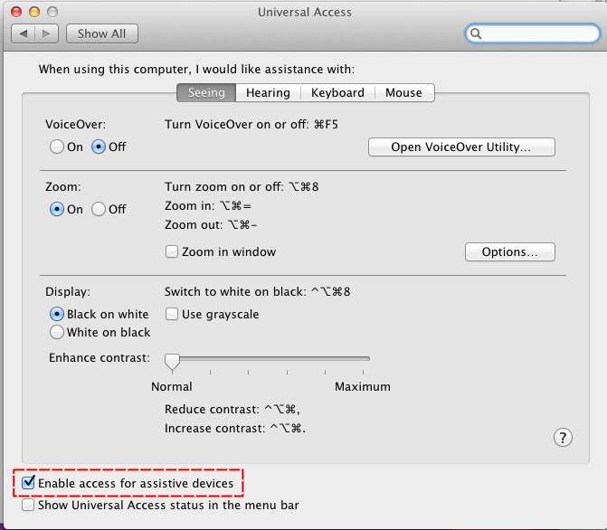

leap-windowflinger
==================

Interact with your desktop with the Leap Motion! To try it out, try
poking windows and moving your finger around to drag windows.

Before running, make sure that "Enable access for assistive devices"
is enabled in the "Universal Access" preference pane.

Currently only Mac OS X is supported. Feel free to supply drivers for
other platforms.

